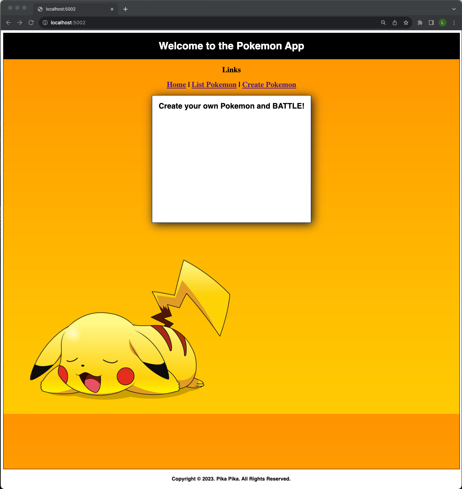
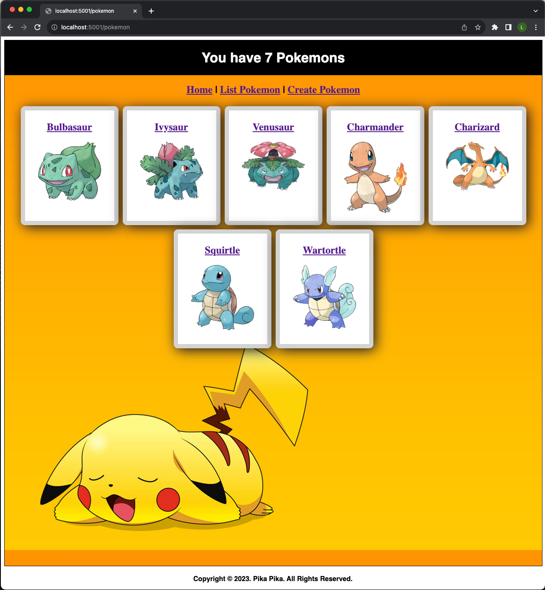
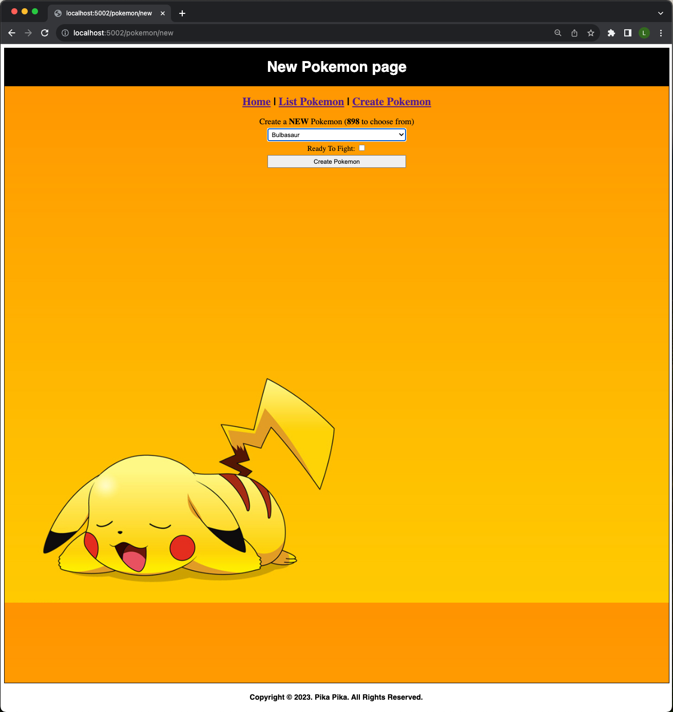
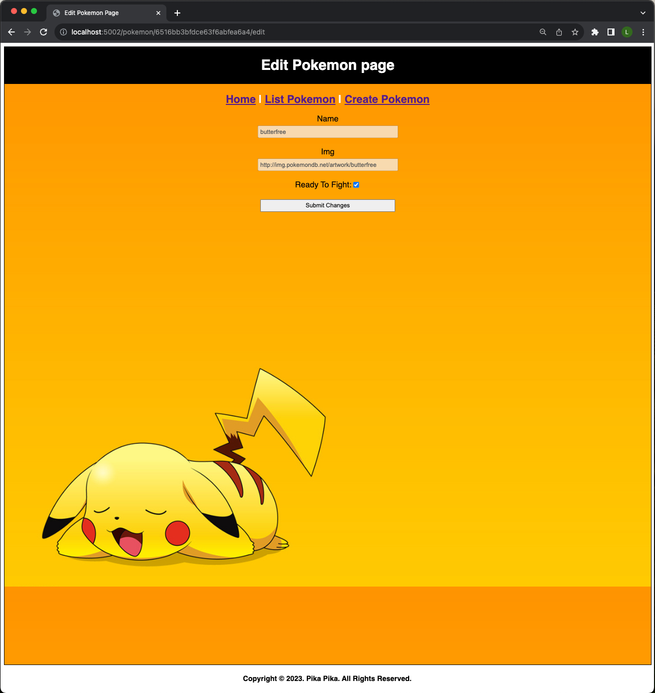
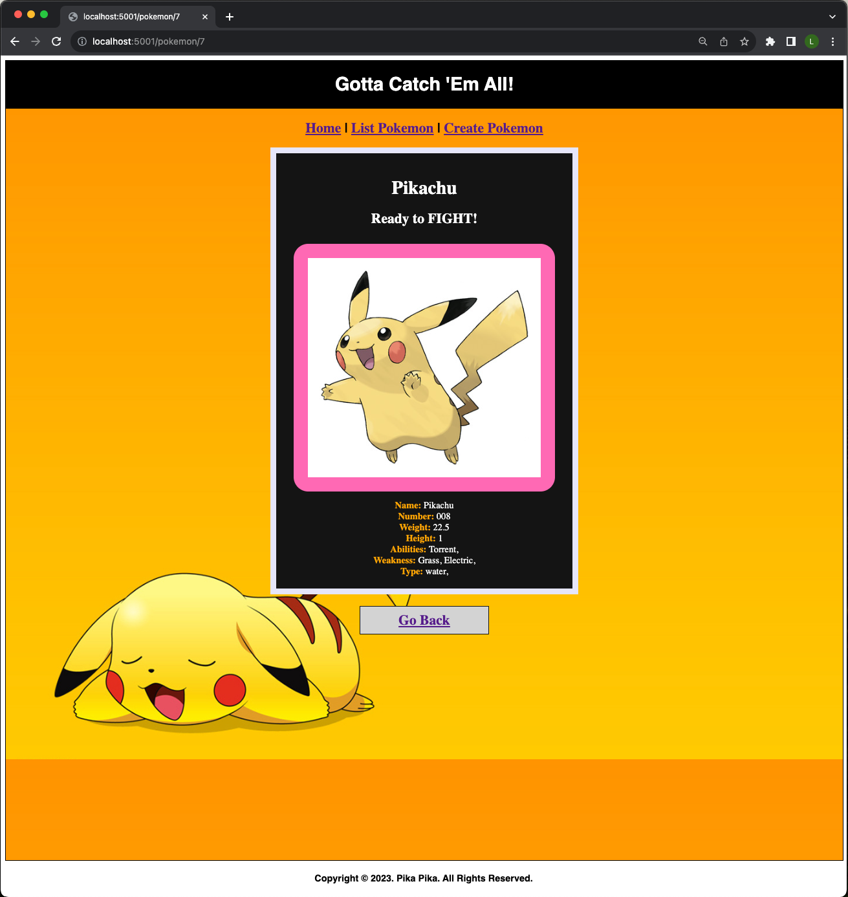
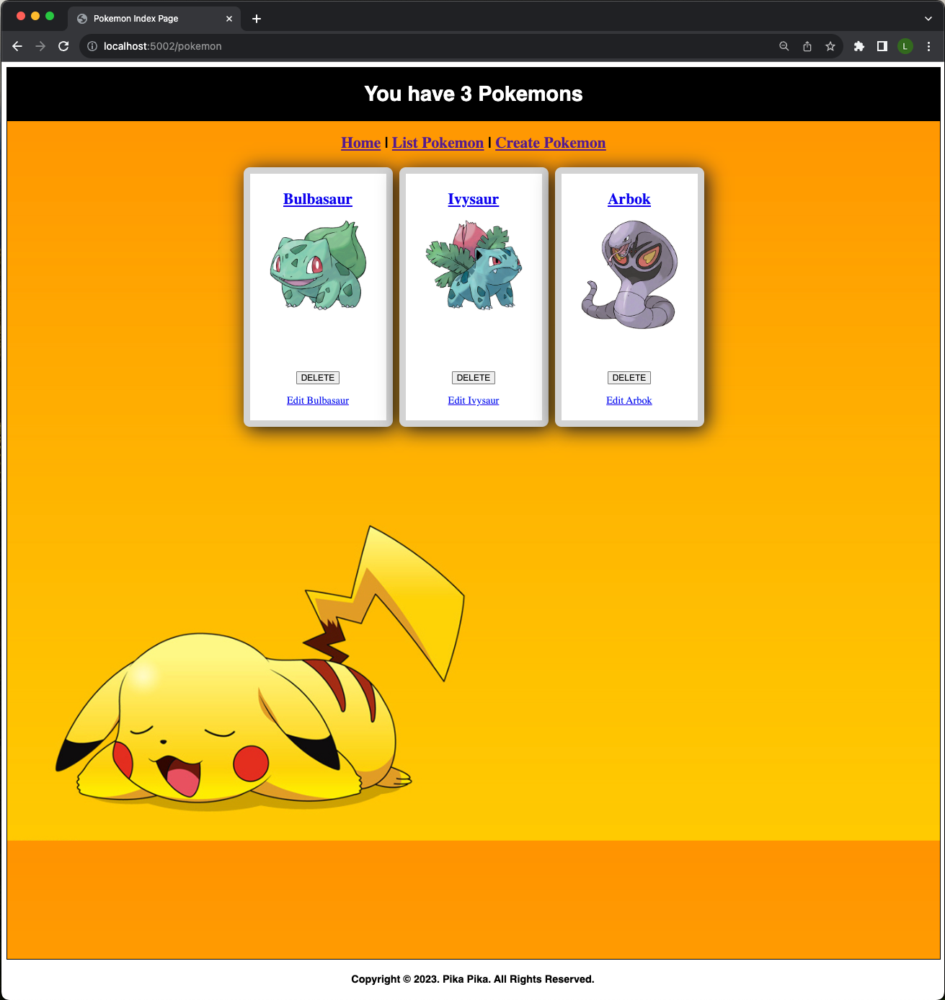

# Introduction
Full CRUD from original [Pokemon App] (https://github.com/lchen104/pokemon_app). You can list, create, modify, delete and show individual pokemon cards.

## Project Description
Make a Pokemon app that displays data inside server-side rendered views.
Images and design was included by me and not part of the mini-project.

# Main Page

# List Pokemons

# Create a new Pokemon

# Edit a Pokemon

# Show Pokemon

# Deleted Pokemon

# Technologies Used
- HTML
- CSS
- Javascript
- Express
- Node
- JSX
- MongoDB